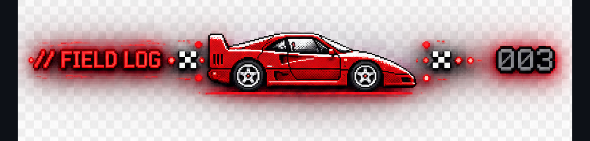

<!-- FFEXP · 2026 · LEVEL 3 · ROGUE · NS · ACTIVE -->

<div align="center">


</div>

<div align="center">


</div>

<br>

```
001 — INITIALIZE
```

**Founding Engineer. Full-Stack. AI-native. Ships fast.**

I build production-grade systems solo — from architecture to deployment, in weeks.
Open-source author. Contract engineer for studios and startups across India.
AI orchestration, high-performance frontends, and deep Linux infrastructure.

Currently building at **Superdesign**.
Previously: **Durell Flooring** · **Studio56 Animation** · **Siemens**.

---

```
002 — WHAT I BUILD
```

> *"I don't build features. I build things people actually use."*

| Layer | Stack |
|---|---|
| **Frontend** | React · Next.js · Vite · TypeScript · Three.js · React Three Fiber · GSAP · Framer Motion |
| **Backend** | Node.js · Express · NestJS · Prisma ORM · PostgreSQL · MongoDB · SQLite · WebSockets · JWT |
| **AI Systems** | MCP · Agentic orchestration · Multi-agent pipelines · RAG · OpenAI · Gemini · Anthropic · Groq |
| **Infrastructure** | Linux (Debian/Kali) · GRUB · systemd · Docker · GitHub Actions · Vercel · AWS · Azure |
| **Security** | OWASP Top 10 · Burp Suite · Metasploit · Bot detection · VS Code Extension API |

---

<div align="center">



</div>

**`rendermw`** &nbsp;·&nbsp; `TypeScript · Node.js · Express · npm`

Zero-dependency Express middleware solving SPA SEO — no Puppeteer, no paid services, no framework rewrites.
Born directly from a production problem at [durell.in](https://durell.in). Then open sourced.

- `701ns` overhead per real-user request
- `108 tests` passing · `18kb` packed · `30+` bot signatures
- Full TypeScript types · in-memory TTL cache · Schema.org JSON-LD builder
- Auto-generating Prisma-backed `sitemap.xml` · `117 pages indexed in 48 hours`

→ **[github.com/brighteyekid/rendermw](https://github.com/brighteyekid/rendermw)** · [rendermw.vercel.app](https://rendermw.vercel.app)

---

**`AegisCode`** &nbsp;·&nbsp; `TypeScript · NestJS · MCP · Gemini API · VS Code API · Next.js · Prisma · PostgreSQL`

VS Code extension scanning AI-generated and manual code in real time for OWASP Top 10 vulnerabilities via a Model Context Protocol pipeline.
Gemini reasons over code and calls 10 registered security tools — one per vulnerability class.

- Findings surface as native VS Code diagnostic markers with severity-based inline underlines
- Side-panel remediation UI · workspace bulk auditing · AI chat remediation bridge
- NestJS/Prisma backend computing a live **Global Health Index** score
- Next.js telemetry dashboard · real-time threat feed · historical risk trend charts
- Turborepo monorepo

→ **[github.com/AnjanyKumarJaiswal/AegisCode](https://github.com/AnjanyKumarJaiswal/AegisCode)**

---

**`Pavitra OS`** &nbsp;·&nbsp; `Debian 12 · live-build · Wine · Darling · Waydroid · Python/GTK3 · GRUB`

Bootable custom Linux distribution built from scratch on Debian 12.
Five native compatibility layers — all via a single GTK3 drag-and-drop launcher.

| Ecosystem | Runtime |
|---|---|
| Windows `.exe` | Wine |
| macOS `.app` | Darling |
| Android `.apk` | Waydroid |
| Linux ELF | Native |
| Debian `.deb` | APT |

Verified functional in QEMU and on real hardware.

→ **[github.com/brighteyekid/Pavitra-OS](https://github.com/brighteyekid/Pavitra-OS)**

---

<div align="center">


</div>

---

```
004 — FIELD EXPERIENCE
```

**Durell Flooring** &nbsp;·&nbsp; Contract Full-Stack &nbsp;·&nbsp; `Feb 2026 – May 2026` &nbsp;·&nbsp; Remote

Owned end-to-end engineering for a production e-commerce platform — [durell.in](https://durell.in)

- React/Vite SPA · Express/Prisma/SQLite backend · custom 15-surface CMS
- Live draft-and-publish workflow · JWT auth · real-time Zoho CRM lead pipeline
- Slug-based SEO URLs · Sharp image pipeline (`94% size reduction via WebP`)
- HTTP 206 video streaming · Google Reviews carousel
- Engineered zero-dependency bot-detection and semantic HTML rendering middleware
- Schema.org JSON-LD per page type · `117 pages indexed in Search Console within 48 hours`
- Subsequently open sourced as **rendermw**

---

**Studio56 Animation** &nbsp;·&nbsp; Contract Frontend &nbsp;·&nbsp; `Dec 2025 – Jan 2026` &nbsp;·&nbsp; Remote

GPU-accelerated component library for an international animation studio.
150+ artists · clients: Netflix · Disney XD · BBC

- Editorial-grade frontend maintaining strict `60fps` across complex scroll-driven animations
- LCP reduced `35%` via Next.js image optimisation, priority loading hints, code splitting
- Validated via Core Web Vitals analysis

---

**Siemens** &nbsp;·&nbsp; IoT Dashboard Engineering &nbsp;·&nbsp; `08 wks` &nbsp;·&nbsp; Remote

Delivered production IoT dashboard interfaces for Siemens industrial systems.

---

```
005 — ESTABLISH CONTACT
```

**OPEN CHANNEL**

`cb2117@srmist.edu.in` &nbsp;·&nbsp; Chennai, India &nbsp;·&nbsp; GMT+5:30

● Available for founding engineer roles & contracts — 2026

[chandra-is-dev.vercel.app](https://chandra-is-dev.vercel.app) &nbsp;·&nbsp; [github.com/brighteyekid](https://github.com/brighteyekid) &nbsp;·&nbsp; [linkedin.com/in/chandrabhayal](https://linkedin.com/in/chandrabhayal)

---

```
006 — CREDENTIALS
```

`MIT SQUARE` — Cyber Intelligence in Robotics (2024)
`Southern Taiwan University` — Linux Server Programming (2024)

AI & ML · Computer Science Engineering · SRM Institute, Chennai

---

<div align="center">

```
AVAILABLE / BUILD FAST / CHANDRA BHAYAL / FULL-STACK PRODUCT ENGINEER / CHENNAI 2026
```

</div>
