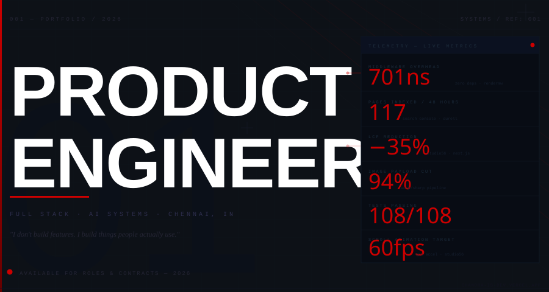

<!-- ANIMATED ROLE TEXT — red monospace, transparent bg -->
<div align="center">


</div>

<!-- CINEMATIC BANNER -->


<br>

---

**`002 — ACTIVE MISSIONS`**

<!-- PROJECT CARDS — 3 public repos, dark themed -->
<p align="center">
  <a href="https://github.com/brighteyekid/rendermw">
    
  </a>
  &nbsp;
  <a href="https://github.com/brighteyekid/aegiscode">
    
  </a>
</p>

<p align="center">
  <a href="https://github.com/brighteyekid/pavitra-os">
    
  </a>
  &nbsp;
  <a href="https://github.com/brighteyekid/durell">
    
  </a>
</p>

<br>

---

**`003 — SYSTEMS & STACK`**

<div align="center">

<br>


<br>


<br>

</div>

<br>

```
FRONTEND   React · Next.js · TypeScript · Three.js · React-Three-Fiber
           Vite · Tailwind CSS · GSAP · Framer Motion

BACKEND    Node.js · Express · NestJS · Prisma · PostgreSQL
           MongoDB · SQLite · WebSockets · REST · JWT

AI         MCP · Agentic Orchestration · Multi-Agent Systems
           OpenAI · Gemini · Anthropic · Groq · RAG Pipelines · Python

INFRA      Linux (Debian / Kali) · Docker · GitHub Actions
           Vercel · AWS (EC2 · S3 · CloudFront) · Azure

SECURITY   OWASP Top 10 · Burp Suite · Metasploit · Bot Detection
```

---

**`004 — PRODUCTION LOG`**

| Period | Client | What Shipped |
|---|---|---|
| `Feb–May 2026` | **Durell Flooring** | End-to-end e-comm platform · 15-surface CMS · 117 pages indexed in 48h · rendermw born here |
| `Dec 2025–Jan 2026` | **Studio56 Animation** | GPU-accelerated component library for Netflix/Disney XD/BBC pipeline · 60fps · LCP −35% |

---

**`005 — CERTIFICATIONS`**

`MIT SQUARE` — Cyber Intelligence in Robotics `2024` &nbsp;·&nbsp; `Southern Taiwan University` — Linux Server Programming `2024`

`SRM Institute of Science and Technology` — B.Tech CS, AI & ML Specialisation, Expected `2027`

---

<!-- FOOTER -->

